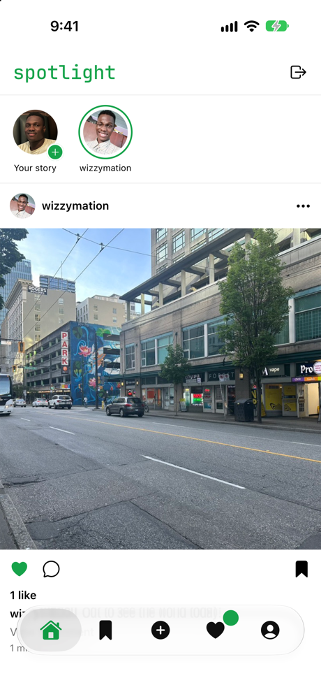
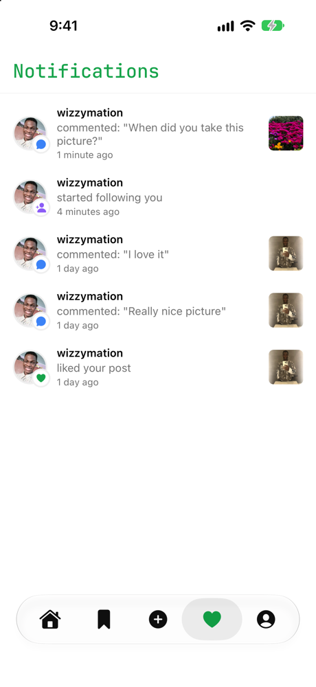
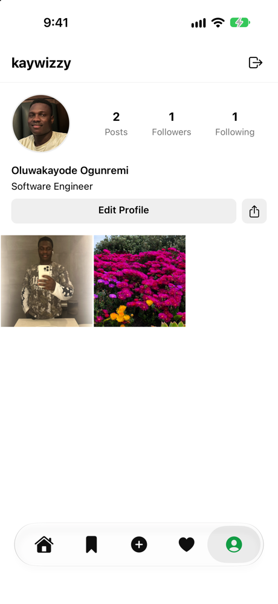
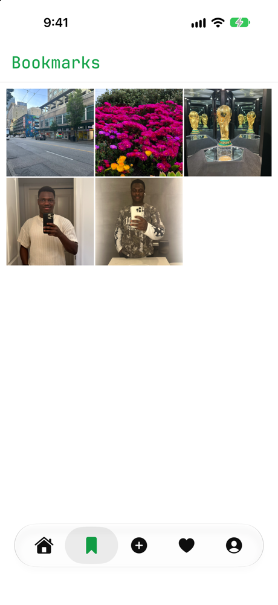
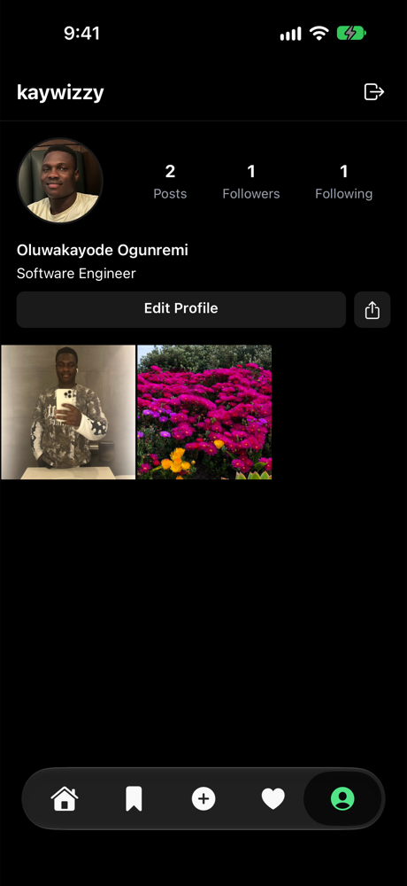

# Spotlight

A cross-platform social media app built with React Native, Expo and TypeScript. Share photos, follow people, react and comment in real time, and post stories that disappear after 24 hours.

## Screenshots

| Feed | Notifications | Profile |
| :---: | :---: | :---: |
|  |  |  |

| Stories | Bookmarks | Dark mode |
| :---: | :---: | :---: |
|  |  |  |

## Features

- **Feed and posts:** share photos with captions, edit captions or delete posts later, and scroll a paginated feed of the latest posts
- **Likes and comments:** like with a tap or a double-tap on the photo, and comment in real time
- **Stories:** post stories that expire after 24 hours, with per-viewer "seen" tracking
- **Follows and profiles:** follow other users and view their profiles and posts
- **Bookmarks:** save posts to revisit later
- **Notifications:** get notified about likes, comments and follows, with an unread indicator
- **Google sign-in** through Clerk
- **Light and dark themes** that follow your device settings

## How it works

**Real-time backend:** the app runs on [Convex](https://convex.dev), a reactive database. Queries update live, so new likes, comments and notifications appear without refreshing. The schema uses indexed tables for users, posts, likes, comments, follows, stories and bookmarks, and keeps like and comment counts on each post for fast feed reads.

**Authentication and user sync:** Clerk handles sign-in. When a new user signs up, Clerk calls a webhook endpoint (`/clerk-webhook`) on the Convex backend. The endpoint verifies the request signature with Svix before creating the user record, so only genuine Clerk events are accepted.

**Image uploads:** photos are resized and compressed on the device before upload, which keeps uploads fast and storage small.

## Tech stack

- React Native with Expo and Expo Router (file-based navigation)
- TypeScript
- Convex (database, real-time queries, file storage, HTTP endpoints)
- Clerk (authentication)
- Svix (webhook signature verification)

## Getting started

### Prerequisites

- Node.js
- A [Convex](https://convex.dev) account
- A [Clerk](https://clerk.com) application with Google sign-in enabled

### Setup

```bash
git clone https://github.com/kaywizzy123/spotlight.git
cd spotlight
npm install
```

Create a `.env.local` file in the project root:

```
EXPO_PUBLIC_CONVEX_URL=your-convex-deployment-url
EXPO_PUBLIC_CLERK_PUBLISHABLE_KEY=your-clerk-publishable-key
```

In your Convex dashboard, set these environment variables:

```
CLERK_JWT_ISSUER_DOMAIN=your-clerk-issuer-domain
CLERK_WEBHOOK_SECRET=your-clerk-webhook-signing-secret
```

In the Clerk dashboard, add a webhook pointing to `https://<your-convex-deployment>.convex.site/clerk-webhook` and subscribe it to the `user.created` event.

### Run

Start the Convex backend in one terminal:

```bash
npx convex dev
```

Start the app in another:

```bash
npx expo start
```

Then open it in Expo Go, an iOS simulator or an Android emulator.

## Project structure

```
src/
  app/
    (auth)/      Login screen
    (tabs)/      Feed, bookmarks, create, notifications, profile
    post/        Single post view
    stories/     Story viewer
    user/        Other users' profiles
  components/    Reusable UI components
  utils/         Image upload and helpers
convex/
  schema.ts      Database schema
  http.ts        Clerk webhook endpoint
  posts.ts, comments.ts, stories.ts, ...   Backend queries and mutations
```

## Author

Built by [Oluwakayode Ogunremi](https://github.com/kaywizzy123)
